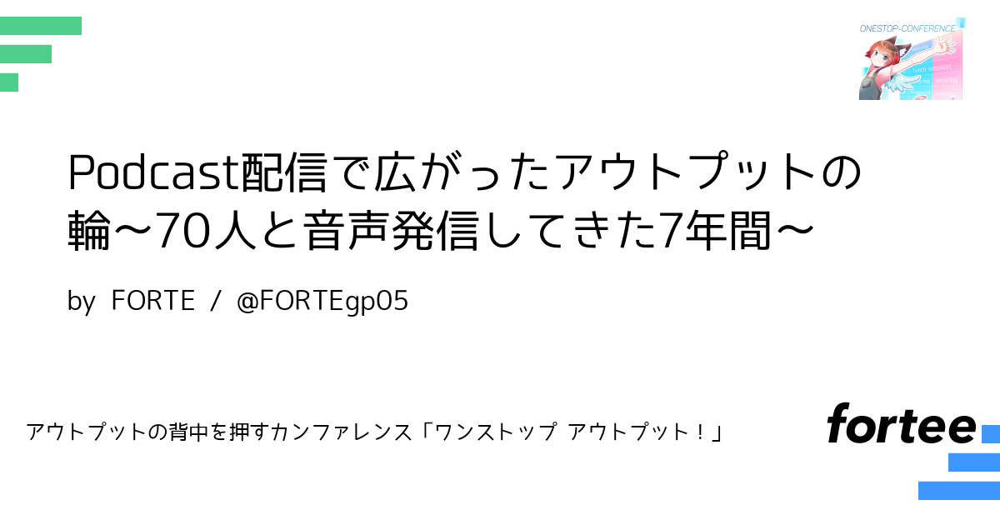
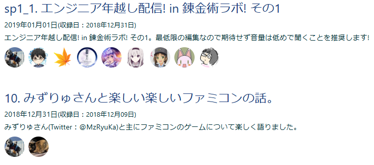

# プロポーザル裏話～FORTE編～

FORTE(フォルテ)@FORTEgp05

## はじめに、大前提
大前提として私は、このカンファレンス「ワンストップアウトプット」のコアスタッフをやっています。

プロポーザルを募集していたforteeというWebサービスがあるのですが、これの設定とかもろもろとかを主催の親方さんと一緒にやっていますし、プロポーザルの選定にも立ち会っています。

実際に手を動かしているのはほとんど親方さんなのですが、相談相手だったり、僕は僕でやれることをやっていたり、というのが前提の話です。

## 私のプロポーザルが生まれた背景と採択の裏話
その上で、まずこのforteeというWebサービスに親方さんが試しにプロポーザルを登録したのですが、「これ他人が登録したらどう見えるか見たいからFORTEさんも登録して」と言われて登録したプロポーザルが、「Podcast配信で広がったアウトプットの輪〜70人と音声発信してきた7年間〜」というプロポーザルになります。

なので裏話の結論としては、実はこのプロポーザルはテストで登録したものなので、よもやこれが採択されるとは私は思っていませんでしたし、自分が選定するときは真っ先に落とそうと思っていました。

しかし、意外と投票が集まってしまい、「いやー僕のプロポーザルはいらないですよね」と言ったのですが、他のスタッフの方が聞きたいということで採択とされてしまったという裏話があります。

### 困ったこと
そのため、いろいろとCFPに書いたのですが、明らかにテストです！みたいな内容だと公開される内容としてどうなのかなと思い、ちょっと真面目に書いただけの内容でした。正直この内容でなにかを話そうみたいなことはあまり考えていなかったのが本音です。そもそもスタッフ権限で落とそうと思っていたくらいなので。

とはいえ、書いた内容はもちろん事実なのですが、15分くらいでパッと書いた内容だったのも事実です。そう考えるとプロポーザルの内容が良い悪いというよりも、次のような内容が評価されたのかもしれません。

- 7年間ポッドキャストをやってきて70人のゲストを呼んだという、なんとなくこの7の語呂がいい
- 「7年間70人っていう数字がすごいっすね」というのがありそう
- Podcastメインでプロポーザルを書いた人が私だけで音声媒体、音声発信というジャンルで残った（残ってしまったのかもしれない）

### 当日の登壇では
どうして雑談系ポッドキャストをやっているんですか？みたいな話とか、「7年間辞めずに続けられてすごいですね」みたいなことも言われるのですが、それは当日の登壇で話そうと思ってます。

ただ、正直辞めずに7年間やってきたかっていうと、2年ぐらい配信していなかったですし、70人のゲストをお呼びしたのですが、それは私がすごいってよりもゲストの方が出てくれたっていう本当にありがたいっていうだけだと思っています。

## 裏話の裏話
実はこの原稿は音声録音したものを文字起こししたものを編集しています。そのため、プロポーザルを見ながら原稿用に話していたのですが、これ本当に良かったのかなというネガティブな感情に襲われてしまいました。

このただ雑談するというこの日常を、アウトプットという形を変えられたもの、その価値みたいなものは確かにあると思っています。それは何かふわっとした表面的なところでは「喋ったらそれはもうアウトプットじゃないですか」のようなものなのですが、そういう表面的な意味もありつつ、何かそこに価値があるのではないかと思っています。

これからその価値を考えてスライドにして、当日登壇しようというところです。

## さいごに
このパンフレットをご覧いただいた方、もしよかったらセッションを聞いてください。公開されたスライドを見てください。カンファレンス当日は懇親会で声かけてください。

そして、よかったら「Podcastに出たいです」と言っていただけると非常にありがたいです。

またこのパンフレットを読んでいる時点でよろしくも何もないかもしれませんが、ワンストップアウトプットをよろしくお願いします。最後までお読み頂きまして、ありがとうございました。

### 宣伝
この寄稿と登壇で話しているPodcast aozora.fmは次のQRコードからアクセスしてみてください。

私と主催の親方さんも関わっている技書博という同人誌即売会のPodcast 技書博ラジオというPodcastもあります。

よろしくお願いします！

#### 本章の執筆者

    
    

        

            <b>FORTE(フォルテ)</b>
            <a href="https://twitter.com/FORTEgp05">Twitter@FORTEgp05</a>
        

        

            サークル名：aozora Project
        

    

Webアプリケーションのバックエンドエンジニアですが、いろいろやってます。Twitter、ブログ、Podcast配信、数多くの趣味と楽しく活動中。
