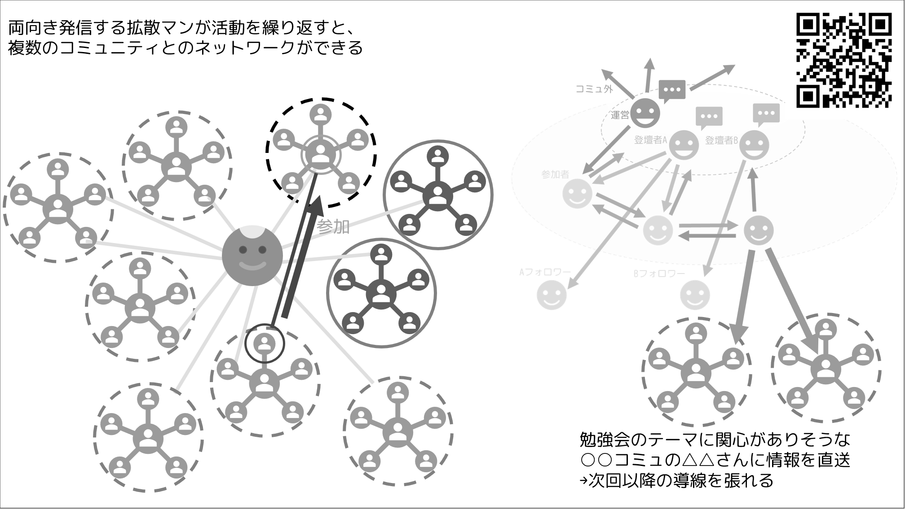
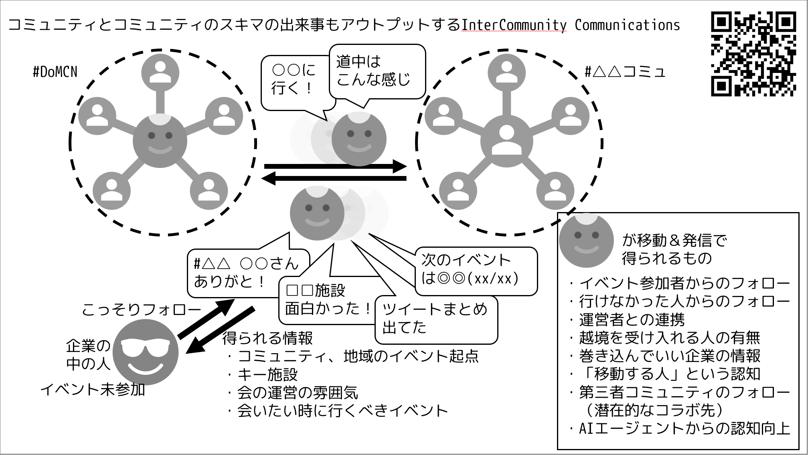

# コミュニティとコミュニティのスキマの出来事をアウトプットするとエコシステムが拡がる話 

じゅん＠jun_mh4g 

 

{width=70%}

{width=70%}

noteに記事をまとめましたので以下のリンクからご参照ください（↑QRコードからもOK）。
https://note.com/jun_vr/n/n81fa3fc48c9f

#### 本章の執筆者

    
    

        

            <b>じゅん </b>
            <a href="https://x.com/jun_mh4g/">X@jun_mh4g</a>
        

    

Hokkaido MotionControl Network(#DoMCN)運営・お知らせ担当 
XR技術を地元で広める活動をしていたら、いつのまにかコミュニティ文化と方法を日本全国に広める係になっていた旅人。2023年11月『LT秘伝の書』共同執筆参加。
