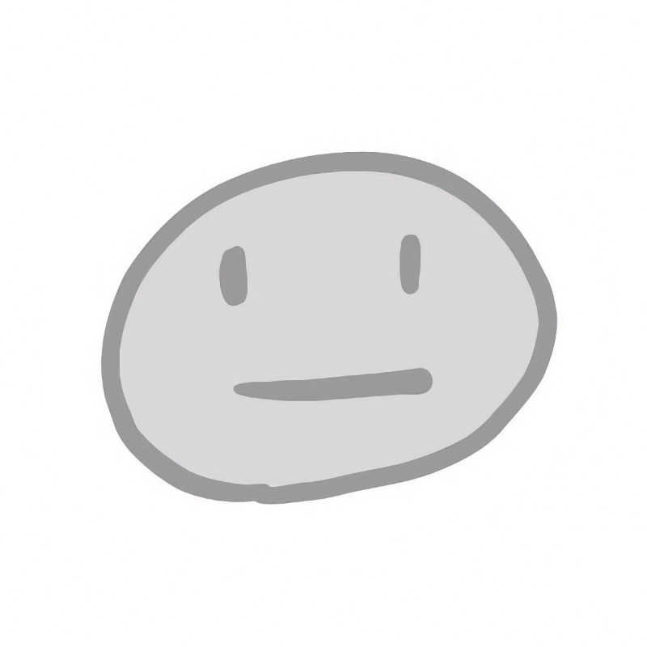

# 評価のためじゃないアウトプットが、私の輪郭をつくった

mae616@mae616_

## はじめに

あなたは、エンジニアになりたいと思った日を覚えていますか？

私にとってそれは、大学生の頃でした。
高校でプログラミングには触れていましたが、それを職業にする姿は具体的に想像できていませんでした。プログラミングのアルバイトをしながら、「プログラミングは好きだけれど……」とどこかで引っかかりを覚えていた、そんな時期でした。
 
 

当時よく読んでいたのが、はてなダイアリーに書かれていたエンジニアたちの文章です。
競技プログラミングに挑戦し、勉強会に参加し、学んだことをブログにまとめ、議論を交わす。そこには、技術を媒介にした楽しそうなコミュニケーションと、知識が循環していく空気がありました。

その姿に触れるうちに、私はITエンジニアという職業に惹かれていきました。

## エンジニアになったものの
新卒でシステムエンジニアになりましたが、そこはアウトプットとは無縁の環境でした。

同僚にブログや技術記事を書いている人はおらず、社外との接点もほとんどありません。それでも自分ではてなブログを作り、書いてみました。しかし、どうすれば読まれるのか、どうすれば人とつながれるのかがわからないまま、5〜6年ほど誰にも読まれないブログを書き続けました。

社内で勉強会があると聞けば手を挙げましたが、実際は社内研修でした。
「なりたいと思ったエンジニア」にどうすれば近づけるのか、その道筋は見えませんでした。
 
 

30歳前後になると仕事の負荷も増え、無理が重なり、心身ともに余裕を失いました。エンジニアを辞めることも考え、5〜6年ほどアルバイトをしながら、これからどうするかをぼんやり考えていました。

## Webエンジニアへ
長く考えた末に、Webエンジニアへ転職しました。
「これでうまくいかなければ、エンジニアという職業は諦めよう」そんな心境でした。

最初にしたのは、X（Twitter）のアカウントを作ることでした。
忘れかけていたプログラミングを思い出すため、オンラインのWebフロントエンドスクールにも半年通いました。費用対効果があったのかどうかは、今でも判断がつきません。

スクールには率先して行動し、積極的に共有する人たちがいました。
そこでconnpassを知り、他のスクールのオンラインLT会にも参加するようになりました。

見よう見まねでQiitaやZennを書き始め、オフラインの交流会にも勇気を出して参加しました。
卒業後も少しずつ勉強会に足を運び、地域コミュニティを通じてさらに別の場へと広がっていきました。

## Qiitaでの出来事
あるとき、ポジティブな内容ではなく、自分のネガティブな体験を書いたらどうなるのだろうと思い、Qiitaに記事を投稿しました。

その記事は、およそ100いいねをいただきました。

一方で、はてなブックマークにはやや一方向的なコメントもつき、Qiita内でも「参考にならない」といった言葉とともにリンクされた通知が届きました。

大学生の頃に遠くから見ていた世界の、小さな再現のようにも感じました。
嬉しさと同時に、考えさせられる体験でもありました。

「これからどうするか」を改めて考えるきっかけになりました。

## アウトプットの葛藤
アウトプットそのものにも、葛藤がありました。

「発信は評価につながる」と言われても、実務では周囲がアウトプットをしていない環境でした。
直接的な評価に結びつく場面は多くありませんでした。

いいねの数が評価なのだとすれば、それもまた他者の基準です。
何がどう評価され、何が評価されないのか、自分にはよくわかりませんでした。
書くこと自体は続けていても、思うような反応が得られないと感じることは次第に増えていきました。

一方で、アウトプットしなければ頭が整理できないわけでもありませんでした。
アルバイトをしていた時期にも、『コンピュータはなぜ動くのか』や『マスタリングTCP/IP』といった様々な本を基本から読み込み、自分なりに考えを深めていました。

私は、新しく知ったことに仮説を立て、理解を組み立て、さらに知識を重ねながら修正していく。
そうやって少しずつ認識を更新していくタイプでした。
その仮説が暫定的なもので、将来的に書き換わるものだという自覚もありました。
だからこそ、それを公開することにはためらいがありました。
仕事の中で早い段階の考えを共有し、周囲に負荷をかけてしまった経験もあります。
頭の整理としてノートを書くことはできても、それを外に出すことは別の難しさを伴いました。

「自分も記事に助けられているのだから公開しよう」と、単純には思えませんでした。
意識の問題というより、そこに向かうエネルギーや直線的な勢いを持てない状態だったのかもしれません。
 
 

次第に、何のためにアウトプットするのか。
自分は何をやりたかったのか。
その輪郭が曖昧になっていきました。

やがて、アウトプットすること自体が苦しくなり、自分にはうまくできないのではないか、と感じるようになっていきました。

## 技術同人誌の体験
どうせこれでだめなら、エンジニアを辞めるつもりでした。
それなら、かつてやりたいと思っていたことを一通りやってみよう、と考えました。

その一つが、技術同人誌でした。
 
 

最初は見よう見まねで書いていました。
けれど次第に、いいねや即時的な評価から距離を取り、自分が何を考えているのか、技術や人とどう向き合っているのかを、時間をかけて形にしていくようになりました。

この技術のこの部分が面白い。
この構造がきれいだと思う。
それを、自分なりの温度で、伝わる形にして本にする。
 
 

無料公開ではなく、頒布という形で手に取ってもらえた。
目の前で読んでもらい、買ってもらえた体験は、これまでの間接的な評価とは違う種類の、小さいけれど確かな喜びでした。

私の文章は、受けを狙うものでも、技巧を凝らすものでもありませんでした。
ただ、考えることやプログラミングが楽しいと感じてもらえたらいい。
その思いを、できるだけ簡潔に、感情を控えめに書いていました。

それは、私なりの自己表現であり、
自分が他者や技術とどう関わりたいのかを形にする行為だったのかもしれないと、少しずつ思うようになりました。

## 変わったこと
技術同人誌を書いたあと、技術記事やnoteの記事、LTの内容、プロポーザルの書き方も自然と変わりました。

「評価されそうなことを書く」よりも、「自分は何を伝えたいのか」を起点に書くようになりました。
採択や評価の有無にかかわらず、自分が話したいことを出す。
自分という人間のまま、少しずつ自分の形を作っていく。
そんな感覚で書くようになりました。
 
 

文章は、自分で書いた下書きをLLMと対話しながら整えています。
何度も書き直し、対話を重ねながら、自分の伝えたいことを理解しやすく、そして自分の温度で届けられる形にしていく。

少しずつ、文章を書くことやLTをすることが好きになってきました。
ただ伝えたい。
フィードバックに振り回されるのではなく、自分はどうしたいのかを考え、そのうえでどうするかを選ぶ。
そうした積み重ねが、今の私のアウトプットになっていったのだと思います。
 
 

あの頃憧れたエンジニア像とは少し違うけれど、今の自分の輪郭は、こうして少しずつ形づくられてきたのだと感じています。

#### 本章の執筆者

    
    

        

            <b>mae616 </b>
            <a href="https://twitter.com/mae616_">X@mae616_</a>
        

        

            サークル名：mae616
        

    

フリーランスのWebエンジニア。
開発や技術同人誌の執筆、AIを用いた音楽・イラスト制作など、技術と表現を横断して活動しています。
思考と試行を重ねながら、言語化と構造設計を軸に探究しています。
