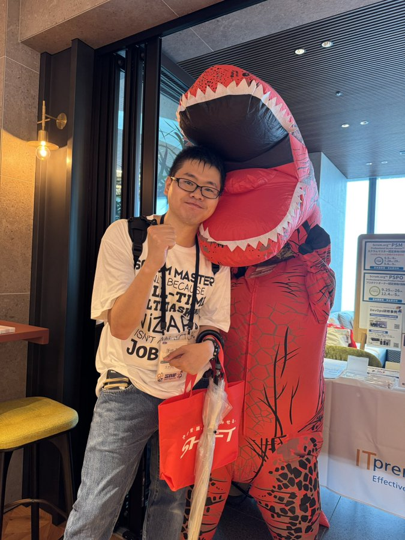

# アウトプットが消極的な私を変えてくれた

モブエンジニア@mob_engineer

本章では、私が今まで行ってきたアウトプット活動を通じて、何事にも消極的だった私の考え・行動がどのように変化していったのかお伝えしたいと思います。

#### 本章の対象者
- アウトプット活動に対して一歩を踏み出せない方
- アウトプットがもたらすメリットを知りたい方
#### 得られる学び
- ちょっとしたきっかけがアウトプット活動のはじまりになる
- アウトプットを通じたフィードバックは気づきを得られる
- アウトプット活動をきっかけに仲間づくり、新たな機会が生まれはじめる

#### 私について

はじめまして。モブエンジニアです。

様々なコミュニティでLT登壇を行うのをライフワークにしています。
最近では、コミュニティ運営として社内外でアウトプットにチャレンジしたい方の支援も行っています。

## アウトプットに興味を持つ前の私

今でこそ積極的に活動を行いアウトプットの楽しさを感じていますが、3年前まではアウトプットに対して消極的な考えを持っていました。当時、従業員数300名前後の中小の独立系SIer企業で社員教育担当を担っており、**技術者が成長するための施策**を日々考えていました。施策と一つとして、社内ブログの執筆を行っていました。内容として、**マネジメント手法**や**リラックス方法**など様々なジャンルで全社員へ発信活動を行っていました。最初のうちは、リアクションボタンなどで反応を示しましたが、徐々にリアクションが薄れていき、ほとんど読まれなくなりました。

**私が発信する意味って何だろうか**と考えるようになり、アウトプット活動に対して消極的な考えを持つようになりました。

## 私を変えたきっかけ

ふと目に入った技術イベントへ参加したことがきっかけでした。
誰もがsnsを通じてイベントの感想を発信しあう光景を見て、**イベントの感想をsnsで発信しあう文化があるんだ**と驚きました。同時に、**snsであれば気軽に感想を言い合えるから面白い**とも思いました。

気軽に発信できる文化に対して面白さを感じ、技術イベントへ積極的に参加するようになりました。その過程で、LT登壇やイベントレポートの執筆も行い始めました。

### アウトプットが楽しくなった

技術イベントなどでアウトプットを行っていくことで、参加者から多くのフィードバックを得ることが出来ました。フィードバックを得ることで、私のアウトプット活動のモチベーションになりました。

また、アウトプットを継続して行っていくことでイベント参加者から認知されるようになり、**○○のイベントを企画しているんだけど一緒に運営やってみない**といったお声がけを頂けるようになりました。

仲間が生まれ、自身の取り組みに対して自信を持つことが出来るようになり、アウトプット活動に対して積極的な考えを持つようになりました。

## まとめ

私自身、アウトプット活動に対して消極的な考えを持っていましたが、ふとしたきっかけで考えを変えることが出来ました。あくまで、私が経験したことなので再現できないこともあると思います。そのうえで、アウトプット活動を通じて**消極的な考えから積極的な考えに変えることが出来た人もいる**というのを記憶に残していただけるとありがたいです。

ぜひ、アウトプット活動を通じて、仲間づくりと新たな機会を作って頂ければ、本記事を書いた意味があると考えています。良きアウトプットライフを実践してみてください。

#### 本章の執筆者

    
    

        

            <b>モブエンジニア</b>
            <a href="https://twitter.com/mob_engineer">X: @mob_engineer</a>
        

    

コミュニティ活動をライフワークとしているエンジニア。最近ではKubernetesとマネジメントについて関心を持っている。