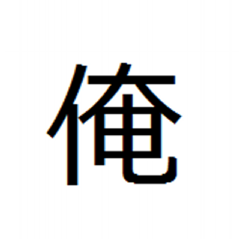

# 打席を逃すな！　アウトプットのススメ

しょっさん（@syossan27）

#### 自己紹介

この章を執筆いたします しょっさん（@syossan27）と申します！
SRE Kaigiの実行委員長や、クラウドネイティブ会議の共同主催、ゆるSRE勉強会の共同運営、SRE Magazineの編集長、一般社団法人SREコネクトの代表理事などSREを中心として色々やっている人間になります。
この章では私のアウトプットの経験を交えつつ、アウトプットをしていくのは人生にとってプラスになるよ！というお話をしていきたいと思います。特にアウトプットに興味はあるけどまだ！という方はぜひ読んでみてください。

## 足が震えた

登壇したことあるよ！って方は一番最初に登壇した時のことを覚えていますか？私はハッキリと覚えています。
2014年に開催されたLaravel Tokyo Meetup vol.4、このイベントで初めてLT登壇をしたのですが、今でも思い出せるくらい足が震えたのを覚えています。
ただ、足の震えを乗り越えて発表した後には、懇親会で様々な方に声をかけていただき、技術の話を思う存分できた本当に良い経験になりました。

本章のタイトルにありますが「打席は逃すな！」というのは、せっかくのアウトプットの機会を逃すなという意で、初めての登壇もXで仲良くなった方から「せっかくだからイベントに登壇してみなよ」とお誘いいただいたおかげで打席に立てたわけです。

その後、繋がりを増やしていき、勉強会をやり始めたり、引き続き登壇をしたり、アウトプットの幅を増やしたり・・・
そんなことをやっていたら、いつの間にかカンファレンスの主催者をやったり、Webマガジンを運営したり、法人を立てたりしているわけで、小さなきっかけから何がどうなるかは本当に分かりません。
一つ絶対的に言えるのは「最初の打席に立たなかったらこんなことにはなってなかった」ということです。
個人的にはアウトプットに良い悪いはありません。それは他人が決めることで自分が決めることではないです。自分にとっては絶対にプラスになると思うので、どんどんアウトプットしていきましょう！

## アウトプットを楽しむために

アウトプットは楽しくないと続きません。どう楽しんでいくのか？は個々人によって様々だと思いますが、私は「他人と交流するきっかけになる」のがモチベーションとなっています。
冒頭から登壇の話をしていましたが、アウトプットとしては元々大学時代からずっとブログを書いていました。しかしながら、一人で続けることは私にとっては結構苦痛で「なんで書いてるんだろう？」としばしば悩みながらやっていました。

しかし、初めての登壇でアウトプットが他人との交流の燃料になるんだ！と気付いたことで、「アウトプット × 交流」が自分にとっての楽しみになったわけです。
これはあくまでも一例ですが、必ず アウトプット × ？？？ のハテナは見つけることが大事だと思っています。

## 打席に立ち続ける

そんなアウトプットですが、続けるためには打席に立ち続けることが肝となってきます。
ブログであれば常に記事を書くネタを見つけ続けること、登壇であれば登壇ネタを増やしつつ登壇できそうなイベントを探し出すことなどなど、打席に立つ機会を生み出すには自発的に動かなければなりません。

特にネタを作って溜めることは絶対にやっておいた方が良いです！
私はこれを登壇などのアウトプットをある程度やるようになってきた時に「ネタがない・・・」という悩みに陥り、その当時の上長がアウトプットの鬼のような方だったのでネタ作りのコツを聞いたところ「ネタになりそうなことは都度書き溜めるんだよ」というアドバイスを頂いたことで習慣づけました。

どういう風にやっているかというと、例えば今だとObsidianのようなアプリで仕事中に少し詰まったところや、もう少し深堀ったら面白くなりそうなどといった普段の開発現場で見つけたアウトプットの種を、どんなに小さくてもいいので書き溜めることです。
もしかしたら「こんなの誰でも知ってるって」と思うようなことでも意外と需要があったりします。昔、絶対に需要ないだろうなと思って書いたSalesforceのApexクラスの本番リリースまでを書いた記事も、意外や意外に1万人を超える人が見てくれていて、Qiitaのいいねも18付いておりました。アウトプットに貴賎なしですね。

このように、何が良いアウトプットのネタになるかは分かりません。日頃からネタを溜めていって、打席に立つ機会が来たら積極的に手を上げて、ネタ帳をフル活用していきましょう！

## 面白いことを探し続ける

これは非常に大事なことですが、無理してアウトプットするのではなく面白いと感じることをやってください！
なにか功名心に囚われてアウトプットをしても、正直疲弊するだけです。自分がやっていて面白いと感じることに対してアウトプットの情熱を注いでいきましょう。

また、面白いと感じれることを常に探し続けてください。自分自身の興味の源泉というのはどこに埋まっているかは本人にも分からないものです。
私がSREと出会った時も、それまでSREを全く知らなかったのですが、仕事でやっていたことがまさにSREであり「これは！」と強く興味を惹かれ現在に至ります。
このように、絶対興味ないだろうなと思ったことでも意外に掘ってみると面白く感じたりするものです。食わず嫌いをせずにまずは新しく知った分野は、面白く感じるか感じないかを判断できるくらいまでには触ってみましょう！最近だとAIで掘ってみるのも楽ですしね。

## まとめ: アウトプットってなんだろう

アウトプットについてザッと話してみましたが、いかがでしたでしょうか？
ここまで書いておいて、アウトプットってなんでしょうね？という疑問が湧いてきました。人によって答えは千差万別だと思いますが、「アウトプットは自己表現」なだけです。
仕事でもプライベートでも、技術以外のことでもアウトプットというのは日頃から何かしらやっていると思います。それを少しの工夫で、もっと人生を面白くするためのエッセンスとすることができるのです。

あなたもアウトプットで人生を面白くしてみませんか？

#### 本章の執筆者

    
    

        

            <b>しょっさん</b>
            <a href="https://twitter.com/syossan27">X: @syossan27</a>
        

    

2019年にMIXI入社。サーバーサイドを中心に開発を行い、 XFLAG STOREアプリのサーバーサイド開発・TIPSTARの初期開発などを経て、現在は Fanstaの開発チームにて遊撃部隊として活動。  
コミュニティ活動としては、SRE Kaigi 実行委員長, SRE Magazine 編集長, ゆるSRE勉強会 共同運営などといった活動を行っている。