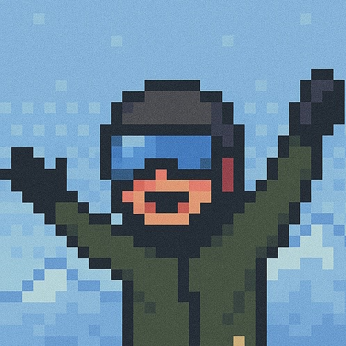

# 「震えながら登壇したら、世界が少し広がった」 ~アウトプットが居場所を連れてきた話~

u-Hoshi(ゆーほし)@u_Hoshi7

70人の前で、足が震えていた。手も震えていた。「みんな気づいているんじゃないか」と思いながら、それでも話し続けた。

初めて登壇した時の自分は、決してうまく話せませんでした。でも、その不格好な一歩が新しい世界へ踏み出すきっかけになりました。

本章では、初登壇から始まったアウトプットの連鎖と、それがもたらした「つながり」のリアルをお伝えします。

## 会社と家族以外に、居場所なんてないと思っていた

当時の自分は、勉強会はすごい人たちの場所だと思っていました。自分には関係ない世界。会社と家だけが、自分の全てでした。

SNSで流れてくる誰かの成果を見るたびに、置いていかれる気がしていました。そんな日々の中で、偶然読んだ記事に「アウトプットが成長に繋がる」という言葉を見つけました。すごい技術力がなくても、自分が改善を重ね、実際に経験し感じたことであれば話せるかもしれない。そう自分に言い聞かせ、震える手で初登壇の申し込みをしました。

特別な成果があったわけではありません。会社で試した小さな工夫や上手くいかなかったコミュニケーションの話など、日々の試行錯誤そのものが自分の発表内容でした。

## 震えながら話したら、声をかけてもらった

自宅で何度も練習を繰り返し、主催者の方にもオンラインで練習に付き合っていただきました。それだけやれば、少しは落ち着いて話せるはずだと思っていました。

でも本番は、そうはなりませんでした。

壇上に立った瞬間、足がすくみました。タイトルでさえ声が震え、「変なことを言っていないか」という不安がずっと頭を巡っていました。発表が終わっても、何を話したか記憶はなく。あれだけ準備したのに、思い通りにはいきませんでした。悔しさと虚しさが入り混じったまま、壇上を降りました。

そのまま逃げ出したい気持ちでいた自分に、声をかけてくれた人がいました。

「自分も似たような経験があって、すごく共感できました」
「話しにくいリアルな失敗談を聞けて、勇気が出ました」

その言葉を聞いた瞬間、不安で一杯だった気持ちが軽くなるのを感じました。うまく話せなかった。それでも、等身大のままで絞り出した言葉は、確かに誰かに届いていました。

## 「また会いましたね」と言える、温かい居場所ができた

初登壇をきっかけに、自分の世界は少しずつ動き始めました。そこで出会った方に誘われ、気づけば広島まで登壇しに行ったり、カンファレンスの当日スタッフに立候補したりと、自分でも驚くほど行動範囲が広がっていきました。

継続して参加するうちに、顔見知りが少しずつ増えていきました。「お久しぶりです」「最近どうですか？」——イベント会場でそんな何気ない挨拶を交わせる相手がいる。それは、以前の自分には想像もできないことでした。

これまでは勉強会に行ってもいつも端っこで一人、スマホを眺めて時間が過ぎるのを待っていました。誰かに話しかけることも、話しかけられることも、ほとんどなかった。でも今は違います。「あのイベントに行けば、またあの人たちに会えるかもしれない」。そのワクワク感が、コミュニティに参加する原動力になっています。会社でも家でもない、第三の居場所を見つけることができました。

## 完璧じゃなくていい

輝かしい実績も、巧みな話術も、自分にはありませんでした。
震える声で、頭が真っ白なまま、それでも「誰かに届けたい」という気持ちだけを持って壇上に立ちました。それだけでした。

でも、その不格好な一歩が、広島への遠征やカンファレンススタッフ、地域のエンジニアとのランチなど、1年前には想像もできなかった世界へ飛び込むきっかけになりました。

完璧じゃなくていい。
「伝えたい」という気持ちがあるなら、それだけで十分です。

あなたの一歩が、誰かと繋がるきっかけになるかもしれません。

#### 著者紹介

    
    

        

            <b>u-Hoshi </b>
            <a href="https://twitter.com/u_Hoshi7">X@u_Hoshi7</a>
        

    

千葉在住のWebエンジニア。最近はClaude CodeやDifyを使い、日常をハックする自作ツールを開発している。趣味はスノーボードやマラソンなど体を動かすこと。
