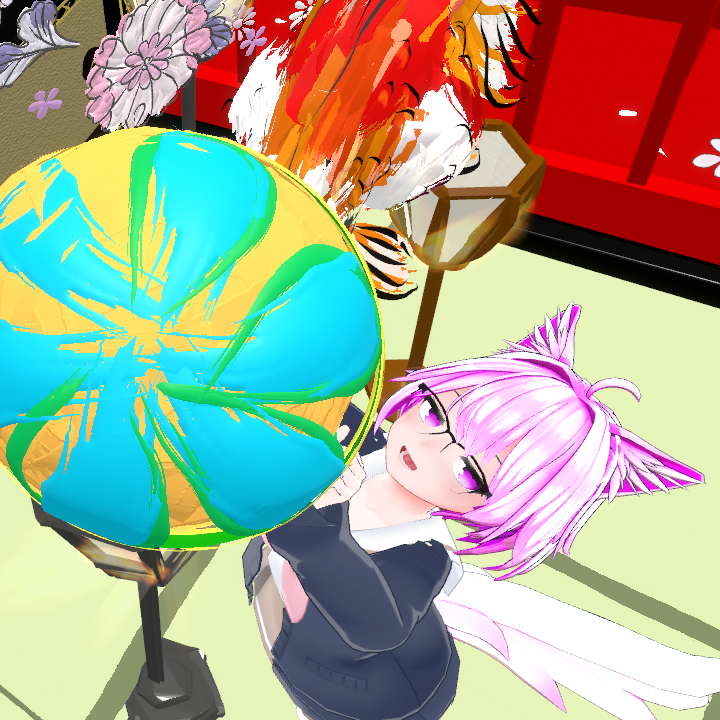

# まず、楽しいからやってみよう

慕狼ゆに@yuni_shinogami

私は慕狼ゆにと申します。Webアプリケーションエンジニアとして働きながら、色々な形でアウトプットをしています。技術記事の執筆から始まり、LT登壇、技術同人誌の制作、コミュニティ活動、配信、そしてXでの日々の発信まで。気がつけば、アウトプットの形はずいぶん広がっていました。

なぜこんなに色々やっているのかと聞かれたら、答えはシンプルです。**楽しいから**です。

アウトプットの方法論やノウハウを語る記事はたくさんあります。でもこの記事では、もっと手前にある気持ちの話をしたいと思います。**「アウトプットって楽しいんだよ」**ということを、私自身の体験を通じてお伝えできたら嬉しいです。

## アウトプットの楽しさって何だろう？

### 反応がもらえる嬉しさ

私がアウトプットを始めたころ、正直なところ反応はあまり期待していませんでした。自分の考えを整理するために書いていた、というのが本音です。

でも、アドベントカレンダーに寄稿した記事に引用RPで感想をもらえたとき、思っていた以上に嬉しかったんです。友人から「あの記事良かったよ」と直接言ってもらえたときも、じわっとくるものがありました。

期待していなかったからこそ、反応をもらえたときの嬉しさは大きかった。たった1いいねでも、「誰かに届いたんだ」と実感できる。私にとってはそれで十分でした。小規模な勉強会でLTをしたときも、その場で直接反応がもらえて、それがまたアウトプットへの気持ちを後押ししてくれました。

### 過去の自分との差分が見える

アウトプットを続けていて一番面白いと感じるのは、**過去の自分との差分が見える**ことです。

私は以前、「めんどくさいフォーム」というタイトルでLTを作ったことがあります。フォームの実装がいかに大変か、という内容です。最初に作ったときはフロントエンドエンジニアだったので、「このコードで実装できます」という実装ベースの話をしていました。

ところが1年後に同じテーマで見直してみると、「なぜこの設計になるのか」という抽象的な設計論として語れるようになっていました。さらにその後バックエンドに転向してからは、バックエンドの視点からもこのテーマを考え直せるようになっていました。同じ「めんどくさいフォーム」なのに、語れる内容がまるで変わっていたんです。

アウトプットを形に残しておくと、こうやって過去の自分と今の自分を比べることができます。その差分を見ることが、私にとってはとても楽しい体験です。

### アウトプットが次につながる

アウトプットを続けていると、思いがけないことが起こります。

発信を通じて横のつながりが広がると、新しいアウトプットの場が自然と目に入るようになります。実際、私はアウトプットがきっかけでTechPlayのセッション登壇に誘っていただいたことがありました。まったく予想していなかった展開で、驚きました。登壇の準備をする中で、分かったつもりだったことを調べ直したり、新しい視点に気づいたりしました。準備そのものが学びになっていたんです。

**アウトプットが人とのつながりを生み、つながりが次の機会を生み、その機会がまた新しい学びにつながる。** まるで積み上げていくゲームのような感覚です。

## まずは「ちょっとやってみる」から

ここまでアウトプットの楽しさについてお話ししてきました。ここからは、私自身がどうやって始めたのかを振り返ってみます。

### 最初の一歩は「好き」から

そんな楽しさを私が最初に感じたのは、会社のアドベントカレンダーに記事を書いたときでした。

当時の私が書いたのは、iTerm2の使い方の紹介記事です。自分なりにかっこいいと思うターミナルの設定や使い方を、そのまま素直に書きました。大した内容ではなかったかもしれません。でも、**自分が好きだと思うものを書くのは、とても楽しかった**。その記憶は今でもはっきり残っています。

最初から大きなことをする必要はありません。好きなこと、かっこいいと思うもの、面白いと感じたこと。そういう気持ちを素直に書くだけで、最初の一歩としては十分です。

### 語りたいことがあるから楽しい

ただ、楽しくなかったときもあります。

LTに連続で応募していた時期がありました。最初のうちは語りたいネタがたくさんあって楽しかったのですが、やがて語りきってしまいました。「次に何を話そう」と悩む日が増えて、イベントのコンセプトに合うネタが思いつかないときは、正直つらかったです。

この経験を通じて気づいたのは、**「これ語ると面白いのでは？」という気持ちがベースにあるとき、アウトプットは自然と楽しくなる**ということです。逆に、ネタをひねり出さなければいけない状態になると、楽しさが消えてしまう。アウトプットに正解はないし、自分なりのペースやタイミングでやっていいんだと思います。

### アウトプットの形は自由

アウトプットと聞くと、ブログ記事や登壇をイメージする方が多いかもしれません。でも、形はもっと自由です。

私自身、色々な形を試してきましたが、それぞれに違った楽しさがあります。たとえば配信を始めたのは、「作業しながらアウトプットできたら一石二鳥では？」という軽い気持ちからでした。やってみたら、配信が作業に集中するきっかけにもなって、今では定期的に続けています。記事は自分の中で伝えたいことが明確にあるときに書く、というスタイルに落ち着きました。もっと言えば、仲間うちで「これ面白かった」と共有するのだって、立派なアウトプットです。

大事なのは、**自分が楽しいと思える形を見つけること**です。全部やる必要はありません。どれか一つ、「これなら自分に合いそう」と思えるものから試してみてください。

## おわりに 一緒にアウトプットしよう！

この記事を書きながら、改めて思いました。自分のアウトプット体験を振り返って言葉にすること自体が、また一つのアウトプットで、そしてやっぱり楽しかった。

アウトプットは楽しいものです。反応がもらえる嬉しさ、過去の自分との差分に気づく面白さ、思いがけない次の機会につながるワクワク感。そのどれもが、実際にやってみて初めて感じられるものだと思います。

好きなものについて書く、面白いと思ったことを共有する。そんな小さなところから、楽しさは始まります。

もしこの記事を読んで何かやってみたくなったら、ぜひ教えてください。私もカンファレンスで、コミュニティを活かしたアウトプットについてお話しする予定です。よかったら覗きに来てもらえると嬉しいです。

一緒にアウトプットを楽しみましょう！

#### 本章の執筆者

    
    

        

            <b>慕狼ゆに </b>
            <a href="https://x.com/yuni_shinogami">X@yuni_shinogami</a>
        

        

            サークル名：エンジニア集会
        

    

にょわにょわWebエンジニア。「エンジニア集会」というコミュニティを運営している。毎週金曜日にVRChatでエンジニア交流会を開催。つよつよエンジニアを目指して修行中。
